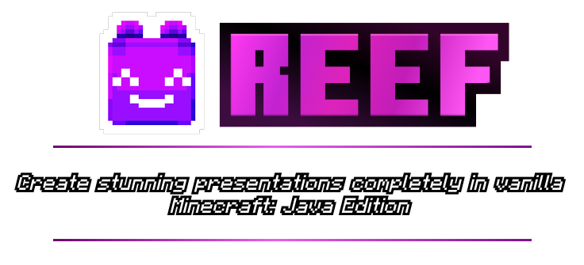
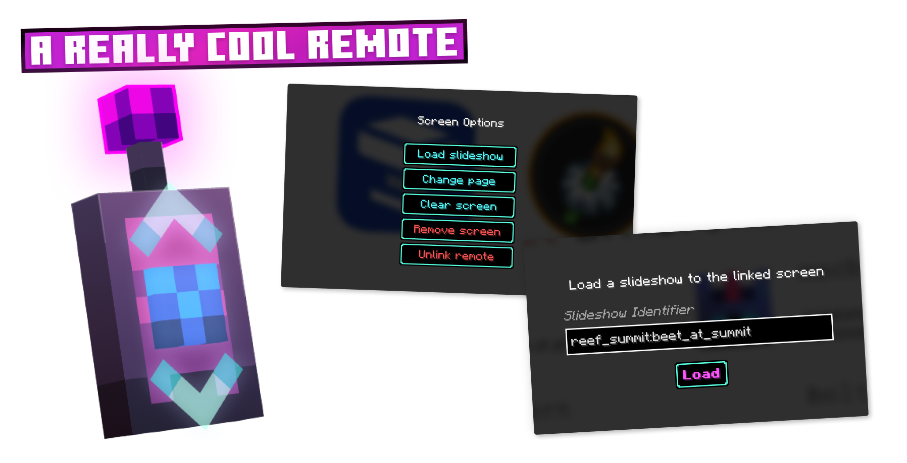
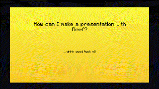
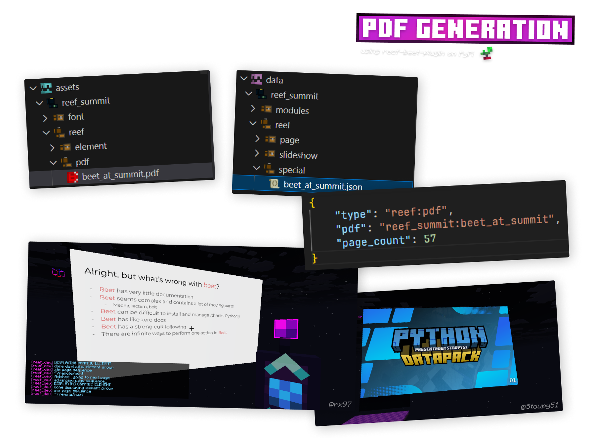

> Reef is a slideshow / slide deck / presentation library that provides tools to make, and present slideshows in-game in Minecraft: Java Edition.

  
  

  

  
  
   
   
  
   
  
  
  
   
   
  
   
  
  

## Credits
- Author - [@trplnr](https://github.com/trplnr)
- Co-author - [@rx-dev](https://github.com/rx-dev)
### Thanks to:
- Smithed Summit team for reaching out to make this project and being the inspiration for this project.
- People who helped me test:
  * [@rx-dev](https://github.com/rx-dev)
  * [@hablethedev](https://github.com/hablethedev)
  * [@Stoupy51](https://github.com/Stoupy51)

